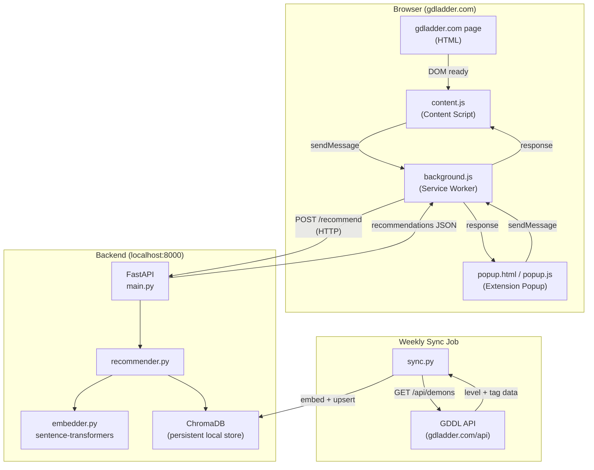

# Final Report

## Project Summary

GDDL Demon Recommender is a Chrome extension + FastAPI backend that recommends Geometry Dash demons from [gdladder.com](https://gdladder.com) based on a user's skill profile. It embeds levels as semantic vectors using community-voted skill tags, then performs cosine similarity search via ChromaDB.

---

## Architecture Overview

The project is split into two layers:

1. **Backend API** — a Python (FastAPI) server responsible for fetching GDDL data, building/updating a vector database, and serving recommendation queries.
2. **Chrome Extension** — a lightweight frontend that injects UI into `gdladder.com` and calls the backend API to show recommendations in context.

This split is important for a few reasons:
- The GDDL API key stays server-side and is never exposed in the extension.
- Heavy embedding and similarity-search work stays off the browser.
- The extension stays thin: collect user input, call API, display results.

```
[gdladder.com page]
      |
 [Chrome Extension]  <──────────────────────────────────────────
      |                                                         |
      | HTTP request (user's beaten levels / desired skillsets) |
      ▼                                                         |
 [FastAPI Backend]                                             UI response
      |          \                                              |
      |           \──── [Vector DB (ChromaDB)] ────────────────
      |                  (level embeddings + metadata)
      |
 [GDDL API] (weekly sync job)
```

### Backend Architecture

```
Chrome Extension (Manifest V3)
  ├── content.js       — injected into gdladder.com; extracts level ID, injects recommendation panel
  ├── background.js    — service worker; proxies all API calls to localhost:8000 (avoids CORS)
  └── popup/           — standalone popup UI with tag pills, tier filters, beaten-level input

FastAPI Backend (localhost:8000)
  ├── main.py          — 3 endpoints: GET /health, POST /recommend, GET /levels/{id}
  ├── recommender.py   — builds query vector, applies tier filters, generates explanations
  ├── embedder.py      — converts tag profiles → text → sentence-transformer embeddings
  ├── db.py            — ChromaDB wrapper (cosine distance, upsert, similarity query)
  └── gddl_client.py   — async GDDL API client with retry + rate-limit handling

Data Pipeline
  └── sync.py          — fetches all levels + tags from GDDL API, embeds, stores in ChromaDB
```

### System Design Diagram



---

## Demo Video

[GDDL Demon Recommender Demo Video](https://www.youtube.com/watch?v=dhiDmYhpbWg)

---

## What Did You Learn?

1. The Chrome extension developer community is very strict with what they allow. And frankly, I am glad they are, because I know that I would not want to download a chrome extension that could execute maliciously. They originally rejected my submission because I requested a permission that I was not using at all, and had no use in my chrome extension. So I removed requesting that permission in my chrome extension and resubmitted and am currently pending review.
2. I learned how to inject content and where to search for targets to inject content into.
3. I think I underestimated how powerful and important caching is. I am able avoid a lot of unecessary calls to a rate-limited API by caching information needed for the chrome extension. For example, I'm caching user data if the amount of level's they've beaten are the same. I'm currently caching each level's `RatingCount`, and I know that the tags won't change if the RatingCount doesn't change. As long as I keep track of and cache the RatingCount for each level, I can determine whether I should fetch the tags for that level or keep the tags currently stored in the DB.

---

## AI Integration

This project embeds level tags into embedding vectors to perform similarity search using sentence transformers. The model used for embedding is "all-MiniLM-L6-v2". Outside of this embedding model, there is no use of an AI or LLM.

---

## Project Development w/ AI

I used Claude Code to develop most of the project code, and reviewed all the code generated by Claude. I also was responsible for all overarching design decisions for the project. Many of these design decisions include: where to host the backend, how the tags are embedded, and especially how the backend handles the request to give the appropriate response.

---

## Why This Project?

I'm chose to work on this project, because I really like playing Geometry Dash and challenging myself to beat some of these hardest levels in the game. I also use the `gdladder.com` website quite a bit and although it is useful to see which levels are more difficult than others, it is difficult to determine what kind of gameplay/skillset those levels feature/challenge.

---

## Failover Strategy, Scaling, Performance, Authentication, Concurrency

**Failover Strategy:** I currently have no failover strategy. I haven't been able to provide much thought to that. Given more time to work on this project (which I will), I will definitely give more thought to this!

**Scaling:** I haven't been able to harden against receiving hundreds of requests per second, and the backend currently is not supported for that. I don't believe the chrome extension will receive such high use to handle that many requests at once. I imagine the backend will get about 200 requests per day on average if the chrome extension is very well received.

**Performance:** The chrome extension caches user data information, so there's no unnecessary API calls to fetch user info when there has been no change. Even though the desired data is stored in a remote backend, the chrome extension looks very responsive and the backend endpoints handles requests within milliseconds. 

**Authentication:** There is no authentication for this chrome extension. All user data is public information that only is retrieved when the user logs in to `gdladder.com`.

**Concurrency:** There is currently no concurrency, but the requests are currently being handled fast enough that I'm not worried about it at the moment.