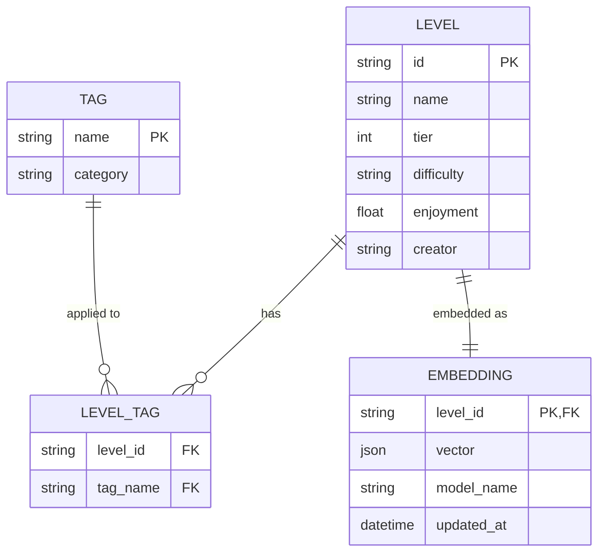
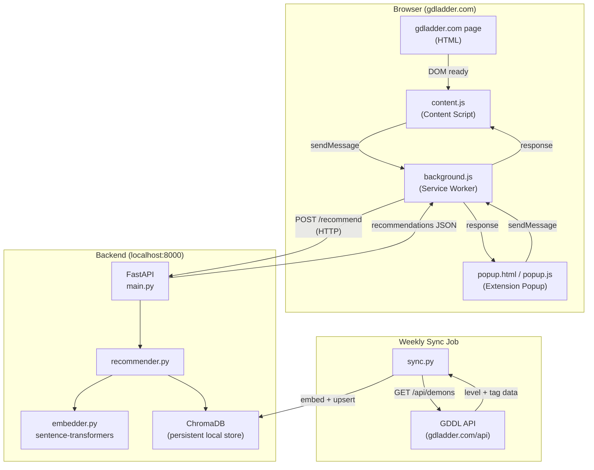

# Initial Project Design
## GDDL Demon Recommender

---

## Project Purpose, Goals, and Design Diagrams 

**Summary of the project's purpose and goals:**

Geometry Dash's hardest levels ("Demons") span an enormous difficulty range, and the community-run GDDL assigns each demon a precise tier (1–35) to capture that range more accurately than the game's five built-in difficulty labels. However, tier alone doesn't tell a player *what skills* a level demands — two tier-15 levels can require completely different techniques (e.g. precision wave vs. memory cube). This means climbing the ladder by raw tier is unreliable: the next level above you might punish a skill you've never trained.

The GDDL Demon Recommender solves this by building a semantic skill profile for every demon from its community-assigned tags (e.g. `wave`, `spam`, `straight fly`, `timings`), then matching a player's existing skill set — derived from the levels they've beaten — to demons at the right difficulty that will build toward the levels they want to conquer. The Chrome extension brings this directly into the gdladder.com experience without requiring a separate app.

**Goals:**
- Accurately model each demon's skill requirements using GDDL tag data and semantic embeddings.
- Recommend the most skill-appropriate demon(s) for a given player, not just the nearest tier.
- Surface recommendations in-context on gdladder.com via a Chrome extension.
- Keep recommendations current with weekly syncs as community ratings evolve.

---

**Initial ERD sketching the data the project will use:**



> **Note:** In ChromaDB the `EMBEDDING` and `LEVEL_TAG` data are stored together as a single document (embedding vector + metadata). The ERD above reflects the logical relationships; there is no relational database in this project.

---

**A rough system design diagram (technologies as shapes, interactions as arrows):**



---

**Initial daily goals from now through April 10th (Appr. 11 days of work):**

| Date | Goal | Est. Hours |
|---|---|---|
| Mar 26 | Project init: set up repo structure, write initial design doc, scaffold backend + extension files | 3 h |
| Mar 27 | Inspect GDDL API live: fetch raw JSON, confirm actual field names and tag structure, update `gddl_client.py` accordingly | 2 h |
| Mar 28 | Run full `sync.py` to populate ChromaDB; verify level count and spot-check stored embeddings | 2 h |
| Mar 29 | Validate embedding quality: query ChromaDB manually and confirm similar-tag levels cluster together | 2 h |
| Mar 31 | End-to-end API test: start FastAPI server, POST to `/recommend` with sample data, verify ranked results | 2 h |
| Apr 1  | Chrome extension Phase 1: load as unpacked extension, confirm `content.js` injects on gdladder.com, inspect DOM for correct selectors | 3 h |
| Apr 2  | Chrome extension Phase 2: popup full flow — tag selection → background.js relay → API → results rendered | 3 h |
| Apr 3  | Skill inference: given only beaten level IDs, automatically derive skill profile without manual tag selection | 3 h |
| Apr 7  | UI polish: tier filter UX, tag pill layout, injected panel styling tuned to gdladder.com theme | 2 h |
| Apr 8  | Sync automation + stretch goals: Windows Task Scheduler setup; begin fine-tuning recommendation ranking if time permits | 2 h |
| Apr 9–10 | End-to-end testing, edge cases (no tags, empty DB, offline API), final documentation pass | 3 h |


---

## Architecture Overview

The project is split into two layers:

1. **Backend API** — a Python (FastAPI) server responsible for fetching GDDL data, building/updating a vector database, and serving recommendation queries.
2. **Chrome Extension** — a lightweight frontend that injects UI into `gdladder.com` and calls the backend API to show recommendations in context.

This split is important for a few reasons:
- The GDDL API key stays server-side and is never exposed in the extension.
- Heavy embedding and similarity-search work stays off the browser.
- The extension stays thin: collect user input, call API, display results.

```
[gdladder.com page]
      |
 [Chrome Extension]  <──────────────────────────────────────────
      |                                                         |
      | HTTP request (user's beaten levels / desired skillsets) |
      ▼                                                         |
 [FastAPI Backend]                                             UI response
      |          \                                              |
      |           \──── [Vector DB (ChromaDB)] ────────────────
      |                  (level embeddings + metadata)
      |
 [GDDL API] (weekly sync job)
```

---

## Data Model

### What the GDDL API provides per level:
- Level ID and name
- Tier rating (1–35 scale)
- Enjoyment rating
- Tags / skillset labels (e.g. `wave`, `straight fly`, `ship`, `timings`, `spam`, `memory`, `precision`, `flow`, etc.)
- Creator(s)
- GD difficulty category (Easy/Medium/Hard/Insane/Extreme Demon)

### What gets stored in the vector database:
Each level becomes a document with:
- **Embedding vector** — derived from its tags and metadata (see Embedding Strategy below)
- **Metadata fields** — `level_id`, `name`, `tier`, `tags[]`, `difficulty`, `enjoyment`

---

## Embedding Strategy

Each demon's "skillset profile" is built from its tag set. Tags are concatenated into a natural-language description (e.g. `"wave spam precision tight corridors"`) and embedded using a sentence-transformer model (`all-MiniLM-L6-v2` is a good starting point — small, fast, free, runs locally).

This gives each level a semantic vector that captures *what kind of gameplay it demands*, not just its numeric tier. Two levels at tier 15 that demand completely different skills will be far apart in vector space.

---

## Recommendation Flow

### Input options (user can provide one or both):
1. **Levels already beaten** — the system averages their embedding vectors to build a "current skill profile"
2. **Desired skillsets** — user selects tags they want to practice (e.g. "I want to improve at wave and straight fly")

### Query:
The combined profile vector is used to do a nearest-neighbor search in the vector database, filtered by:
- Tier range slightly above the player's current level (configurable ± window)
- Optionally filtered by difficulty category

### Output:
A ranked list of recommended demons with their names, tiers, tags, and a brief explanation of why each was recommended.

---

## Tech Stack

| Layer | Technology | Reason |
|---|---|---|
| Backend API | Python + FastAPI | Ideal for ML tasks; easy async; great ecosystem |
| Vector DB | ChromaDB (local) | Free, no setup, runs embedded in-process; can migrate to Supabase pgvector if hosting is needed |
| Embeddings | `sentence-transformers` (`all-MiniLM-L6-v2`) | Free, runs locally, no API key needed |
| Data sync | Python script (cron / manual trigger) | Pulls from GDDL API and upserts into ChromaDB |
| Chrome Extension | HTML/CSS/Vanilla JS (Manifest V3) | Injects UI into gdladder.com; calls backend over localhost or hosted URL |
| Packaging | `uv` or `pip` + `requirements.txt` | Standard Python dependency management |

---

## Chrome Extension Design

The extension targets `gdladder.com`. It adds a sidebar or floating panel on level pages and on the user profile page.

**On a level's page:** Shows "Players who beat this also recommend..." style suggestions — demons with similar skillsets at nearby tiers.

**On a user's profile page (if accessible via GDDL):** Reads the user's completed levels and generates a full personalized recommendation list.

**Manifest V3 note:** Background service workers replace persistent background pages. All API calls to the backend are made from the popup/content script directly.

---

## Data Sync

A standalone Python script (`sync.py`) is responsible for:
1. Fetching all demons from the GDDL API
2. Generating embeddings for any new or changed levels
3. Upserting into ChromaDB

This script can be run manually or on a weekly schedule (e.g. via Windows Task Scheduler or a cron job if hosted on Linux). The GDDL community updates tier ratings as new demons get released and opinions evolve, so weekly refreshes keep recommendations current.

---

## Development Phases

| Phase | Goal |
|---|---|
| 1. Data pipeline | Fetch GDDL data, inspect available fields (especially tags), store raw JSON |
| 2. Embedding + DB | Build ChromaDB collection from level tags; verify similarity search works correctly |
| 3. Recommendation API | FastAPI endpoint: `POST /recommend` accepts beaten levels + desired tags, returns ranked list |
| 4. Chrome Extension UI | Inject panel into gdladder.com; wire up to the API |
| 5. Sync job | Weekly refresh script |
| 6. Skill inference | Given only a list of beaten levels, infer skill profile automatically (no manual tag selection required) |

---

## Open Questions

- **What tags does the GDDL API actually expose per level?** This is the most critical unknown. If tags are sparse or absent, an alternative embedding strategy is needed (e.g. using level descriptions, creator reputation, or a manual tag dataset from the community).
- **Is the GDDL user profile (completed levels list) accessible via API?** If yes, the extension can auto-populate the player's beaten levels. If not, the user must input them manually.
- **Hosting:** For a course project, running the backend locally (`localhost:8000`) is fine. If public access is needed later, a simple free-tier deployment (Railway, Render, Fly.io) works.
- **Chrome Extension vs. Web App:** If the GDDL API has CORS restrictions or if injecting into gdladder.com proves impractical, the extension can be swapped for a standalone web app with minimal rework — the backend API is the same either way.
